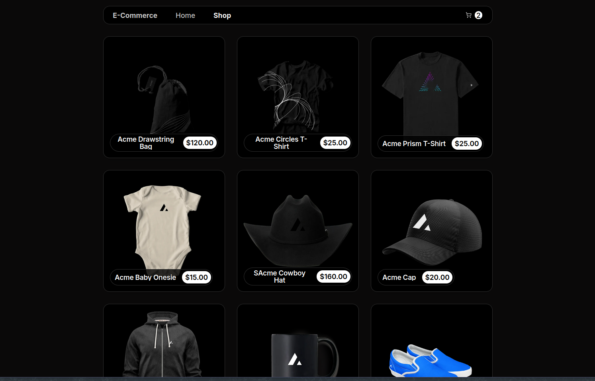

<a href="https://ecommerce-opal-beta.vercel.app/">
  
  <h1 align="center" >Ecommerce Website</h1>
</a>

  A simple web ecommerce website made with React and .NET

## Introduction

This is a personal project built with React and .NET. It is a simple ecommerce website that allows users to browse products, add them to cart, and checkout. The website is built with Next.js and Tailwind CSS. The backend is built with C# and .NET. The website is hosted on Vercel and the backend is hosted on Azure. The database is hosted on Azure using Microsoft SQL Server.

### Tech Stack

- **Frontend Framework:** [Next.js](https://nextjs.org)
- **Backend Framework:** [.NET](https://dotnet.microsoft.com)
- **Database:** [Microsoft SQL Server](https://www.microsoft.com/en-us/sql-server)
- **Styling:** [Tailwind CSS](https://tailwindcss.com)
- **UI Components:** [Shadcn/ui](https://ui.shadcn.com)
- **Deployment:** [Vercel](https://vercel.com/) and [Azure](https://azure.microsoft.com)

## TODO

- Features
  - [] Checkout page
  - [] Integration with payment gateway
  - [] User authentication
